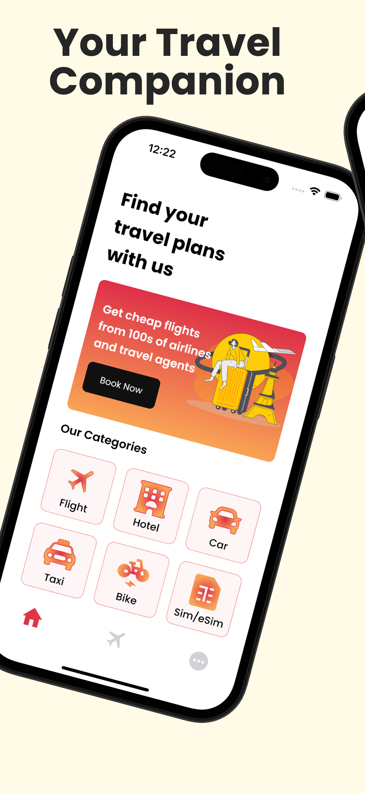
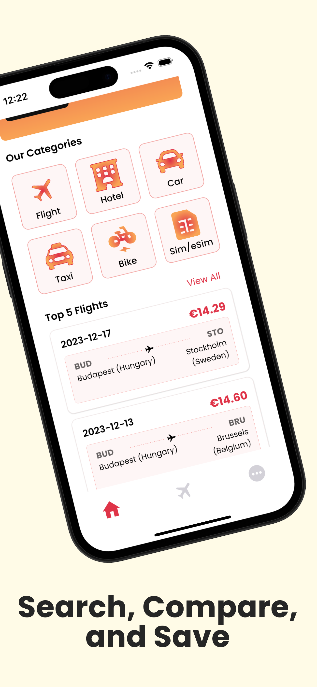
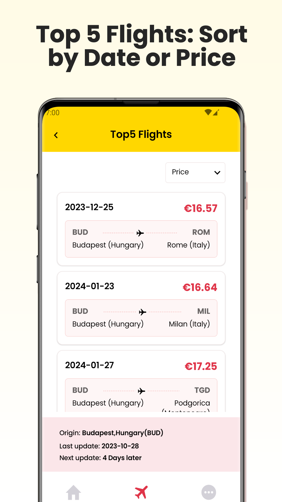
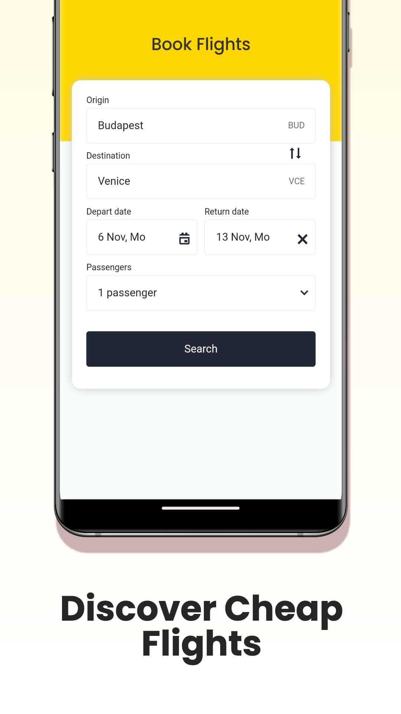

# FindTravelNow - Travel App for iOS and Android

 

[FindTravelNow](https://app.findtravelnow.com/) is metasearch travel application that is available both in [AppStore](https://apps.apple.com/gr/app/findtravelnow/id6471192930) and [Google Play Store](https://play.google.com/store/apps/details?id=com.travelapp.findtravelnow) developed with Kotlin Multiplatform + Compose Multiplatform.

| Android | iOS |
|:-:|:-:|
|  |  |

## Screenshots

  
  
  
  

## Features
  - 🎒 All in one travel features
  - 📱 Multiplatform (android and iOS)
  - ✈️ Find cheap flights, and get weekly updated Top 5 flights
  - 🛏️ See deals from many hotels/hostels and accommodations in one place.
  - 🚕 Car renting when you travel
  - 🚴 Rent a motorcycle, scooter or bicycle

## Tech stack

- [Kotlin Multiplatform](https://www.jetbrains.com/kotlin-multiplatform/) - targets android and iOS platforms
- [Compose Multiplatform](https://www.jetbrains.com/lp/compose-multiplatform/) - UI part
- [Kotlin Coroutines](https://kotlinlang.org/docs/coroutines-overview.html) - For handling asynchronous part
- [Ktor](https://ktor.io/) - Networking library
- [Koin](https://insert-koin.io/) - DI framework
- [Voyager](https://github.com/adrielcafe/voyager) - Multiplatform Navigation library
- [KMPNotifier](https://github.com/mirzemehdi/KMPNotifier/) - Multiplatform Push Notification library
- [KMPAuth](https://github.com/mirzemehdi/KMPAuth/) - Multiplatform Authentication library  
- [Napier](https://github.com/AAkira/Napier) - Multiplatform Logging library
- [Multiplatform Settings](https://github.com/russhwolf/multiplatform-settings) - Multiplatform library for saving simple key-value data

## CI/CD
In each push to any branch debug application for both android and ios will be built.  
Whenever new tag is pushed release app will be distributed to both Google Play and AppStore in testing track. 

## Contributing
Feel free to open new issue for feature suggestion, or bug fixing or anything related to project architecture, or just a suggestion :).

